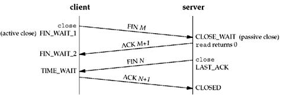

# Linux-TCP/IP TIME_WAIT状态原理

通信双方建立TCP连接后，主动关闭连接的一方就会进入TIME_WAIT状态。

客户端主动关闭连接时，会发送最后一个ack后，然后会进入TIME_WAIT状态，再停留2个MSL时间(后有MSL的解释)，进入CLOSED状态。

下图是以客户端主动关闭连接为例，说明这一过程的。



## TIME_WAIT状态存在的理由

TCP/IP协议就是这样设计的，是不可避免的。主要有两个原因:

1）可靠地实现TCP全双工连接的终止

TCP协议在关闭连接的四次握手过程中，最终的ACK是由主动关闭连接的一端（后面统称A端）发出的，如果这个ACK丢失，对方（后面统称B端）将重发出最终的FIN，因此A端必须维护状态信息（TIME_WAIT）允许它重发最终的ACK。如果A端不维持TIME_WAIT状态，而是处于CLOSED 状态，那么A端将响应RST分节，B端收到后将此分节解释成一个错误（在java中会抛出connection reset的SocketException)。

因而，要实现TCP全双工连接的正常终止，必须处理终止过程中四个分节任何一个分节的丢失情况，主动关闭连接的A端必须维持TIME_WAIT状态 。

2）允许老的重复分节在网络中消逝 

TCP分节可能由于路由器异常而“迷途”，在迷途期间，TCP发送端可能因确认超时而重发这个分节，迷途的分节在路由器修复后也会被送到最终目的地，这个迟到的迷途分节到达时可能会引起问题。在关闭“前一个连接”之后，马上又重新建立起一个相同的IP和端口之间的“新连接”，“前一个连接”的迷途重复分组在“前一个连接”终止后到达，而被“新连接”收到了。为了避免这个情况，TCP协议不允许处于TIME_WAIT状态的连接启动一个新的可用连接，因为TIME_WAIT状态持续2MSL，就可以保证当成功建立一个新TCP连接的时候，来自旧连接重复分组已经在网络中消逝。


### MSL时间

MSL就是maximum segment lifetime(最大分节生命期），这是一个IP数据包能在互联网上生存的最长时间，超过这个时间IP数据包将在网络中消失 。MSL在RFC 1122上建议是2分钟，而源自berkeley的TCP实现传统上使用30秒。


## TIME_WAIT状态维持时间

TIME_WAIT状态维持时间是两个MSL时间长度，也就是在1-4分钟。Windows操作系统就是4分钟。

### 用于统计当前各种状态的连接的数量的命令

```
netstat -n | awk '/^tcp/ {++S[$NF]} END {for(a in S) print a, S[a]}'
```

返回结果如下：

```
LAST_ACK 14
SYN_RECV 348
ESTABLISHED 70
FIN_WAIT1 229
FIN_WAIT2 30
CLOSING 33
TIME_WAIT 18122

对上述结果的解释：

CLOSED：无连接是活动的或正在进行
LISTEN：服务器在等待进入呼叫
SYN_RECV：一个连接请求已经到达，等待确认
SYN_SENT：应用已经开始，打开一个连接
ESTABLISHED：正常数据传输状态
FIN_WAIT1：应用说它已经完成
FIN_WAIT2：另一边已同意释放
ITMED_WAIT：等待所有分组死掉
CLOSING：两边同时尝试关闭
TIME_WAIT：另一边已初始化一个释放
LAST_ACK：等待所有分组死掉
```

## 进一步论述这个问题：

### 客户端主动关闭连接

注意一个问题，进入TIME_WAIT状态的一般情况下是客户端。大多数服务器端一般执行被动关闭，服务器不会进入TIME_WAIT状态。当在服务器端关闭某个服务再重新启动时，服务器是会进入TIME_WAIT状态的。

举例：
1.客户端连接服务器的80服务，这时客户端会启用一个本地的端口访问服务器的80，访问完成后关闭此连接，立刻再次访问服务器的 80，这时客户端会启用另一个本地的端口，而不是刚才使用的那个本地端口。原因就是刚才的那个连接还处于TIME_WAIT状态。

2.客户端连接服务器的80服务，这时服务器关闭80端口，立即再次重启80端口的服务，这时可能不会成功启动，原因也是服务器的连接还处于TIME_WAIT状态。

服务端提供服务时，一般监听一个端口就够了。例如Apach监听80端口。

客户端则是使用一个本地的空闲端口（大于1024），与服务端的Apache的80端口建立连接。

当通信时使用短连接，并由客户端主动关闭连接时，主动关闭连接的客户端会产生TIME_WAIT状态的连接，一个TIME_WAIT状态的连接就占用了一个本地端口。这样在TIME_WAIT状态结束之前，本地最多就能承受6万个TIME_WAIT状态的连接，就无端口可用了。

客户端与服务端进行短连接的TCP通信，如果在同一台机器上进行压力测试模拟上万的客户请求，并且循环与服务端进行短连接通信，那么这台机器将产生4000个左右的TIME_WAIT socket，后续的短连接就会产生address already in use : connect的异常。

关闭的时候使用RST的方式，不进入 TIME_WAIT状态，是否可行？

### 服务端主动关闭连接

服务端提供在服务时，一般监听一个端口就够了。例如Apache监听80端口。

客户端则是使用一个本地的空闲端口（大于1024），与服务端的Apache的80端口建立连接。

当通信时使用短连接，并由服务端主动关闭连接时，主动关闭连接的服务端会产生TIME_WAIT状态的连接。

由于都连接到服务端80端口，服务端的TIME_WAIT状态的连接会有很多个。

假如server一秒钟处理1000个请求，那么就会积压240秒*1000=24万个TIME_WAIT的记录，服务有能力维护这24万个记录。

大多数服务器端一般执行被动关闭，服务器不会进入TIME_WAIT状态。

服务端为了解决这个TIME_WAIT问题，可选择的方式有三种：

* 保证由客户端主动发起关闭（即做为B端）
* 关闭的时候使用RST的方式
* 对处于TIME_WAIT状态的TCP允许重用
 
一般Apache的配置是：

```
Timeout 30  

KeepAlive On   #表示服务器端不会主动关闭链接  

MaxKeepAliveRequests 100  

KeepAliveTimeout 180  
```

表示：Apache不会主动关闭链接，

两种情况下Apache会主动关闭连接：

1、Apache收到了http协议头中有客户端要求Apache关闭连接信息，如setRequestHeader("Connection", "close");  

2、连接保持时间达到了180秒的超时时间，将关闭。

如果配置如下：

```
KeepAlive Off   #表示服务器端会响应完数据后主动关闭链接  
```
--------------有代理时------------------------------

nginx代理使用了短链接的方式和后端交互，如果使用了nginx代理，那么系统TIME_WAIT的数量会变得比较多，这是由于nginx代理使用了短链接的方式和后端交互的原因，使得nginx和后端的ESTABLISHED变得很少而TIME_WAIT很多。这不但发生在安装nginx的代理服务器上，而且也会使后端的app服务器上有大量的TIME_WAIT。查阅TIME_WAIT资料，发现这个状态很多也没什么大问题，但可能因为它占用了系统过多的端口，导致后续的请求无法获取端口而造成障碍。

对于大型的服务，一台server搞不定，需要一个LB(Load Balancer)把流量分配到若干后端服务器上，如果这个LB是以NAT方式工作的话，可能会带来问题。假如所有从LB到后端Server的IP包的source address都是一样的(LB的对内地址），那么LB到后端Server的TCP连接会受限制，因为频繁的TCP连接建立和关闭，会在server上留下TIME_WAIT状态，而且这些状态对应的remote address都是LB的，LB的source port撑死也就60000多个(2^16=65536,1~1023是保留端口，还有一些其他端口缺省也不会用），每个LB上的端口一旦进入Server的TIME_WAIT黑名单，就有240秒不能再用来建立和Server的连接，这样LB和Server最多也就能支持300个左右的连接。如果没有LB，不会有这个问题，因为这样server看到的remote address是internet上广阔无垠的集合，对每个address，60000多个port实在是够用了。

一开始我觉得用上LB会很大程度上限制TCP的连接数，但是实验表明没这回事，LB后面的一台Windows Server 2003每秒处理请求数照样达到了600个，难道TIME_WAIT状态没起作用？用Net Monitor和netstat观察后发现，Server和LB的XXXX端口之间的连接进入TIME_WAIT状态后，再来一个LB的XXXX端口的SYN包，Server照样接收处理了，而是想像的那样被drop掉了。翻书，从书堆里面找出覆满尘土的大学时代买的《UNIX Network Programming, Volume 1, Second Edition: Networking APIs: Sockets and XTI》，中间提到一句，对于BSD-derived实现，只要SYN的sequence number比上一次关闭时的最大sequence number还要大，那么TIME_WAIT状态一样接受这个SYN，难不成Windows也算BSD-derived?有了这点线索和关键字(BSD)，找到这个post，在NT4.0的时候，还是和BSD-derived不一样的，不过Windows Server 2003已经是NT5.2了，也许有点差别了。

做个试验，用Socket API编一个Client端，每次都Bind到本地一个端口比如2345，重复的建立TCP连接往一个Server发送Keep-Alive=false的HTTP请求，Windows的实现让sequence number不断的增长，所以虽然Server对于Client的2345端口连接保持TIME_WAIT状态，但是总是能够接受新的请求，不会拒绝。那如果SYN的Sequence Number变小会怎么样呢？同样用Socket API，不过这次用Raw IP，发送一个小sequence number的SYN包过去，Net Monitor里面看到，这个SYN被Server接收后如泥牛如海，一点反应没有，被drop掉了。

按照书上的说法，BSD-derived和Windows Server 2003的做法有安全隐患，不过至少这样至少不会出现TIME_WAIT阻止TCP请求的问题，当然，客户端要配合，保证不同TCP连接的sequence number要上涨不要下降。

Q: 我正在写一个unix server程序，不是daemon，经常需要在命令行上重启它，绝大多数时候工作正常，但是某些时候会报告"bind: address in use"，于是重启失败。 

A: Andrew Gierth 

server程序总是应该在调用bind()之前设置SO_REUSEADDR套接字选项。至于TIME_WAIT状态，你无法避免，那是TCP协议的一部分。

Q: 编写 TCP/SOCK_STREAM 服务程序时，SO_REUSEADDR到底什么意思？ 

A: 这个套接字选项通知内核，如果端口忙，但TCP状态位于 TIME_WAIT ，可以重用端口。如果端口忙，而TCP状态位于其他状态，重用端口时依旧得到一个错误信息， 指明"地址已经使用中"。如果你的服务程序停止后想立即重启，而新套接字依旧使用同一端口，此时 SO_REUSEADDR 选项非常有用。必须意识到，此时任何非期 望数据到达，都可能导致服务程序反应混乱，不过这只是一种可能，事实上很不可能。 

一个套接字由相关五元组构成，协议、本地地址、本地端口、远程地址、远程端口。SO_REUSEADDR 仅仅表示可以重用本地本地地址、本地端口，整个相关五元组 还是唯一确定的。所以，重启后的服务程序有可能收到非期望数据。必须慎重使用 SO_REUSEADDR 选项。 


